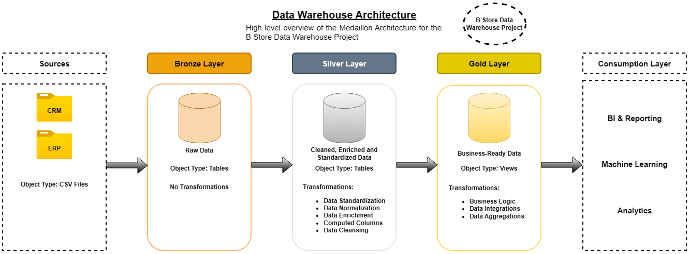
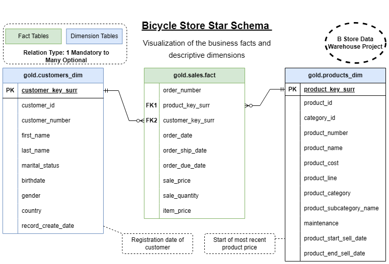
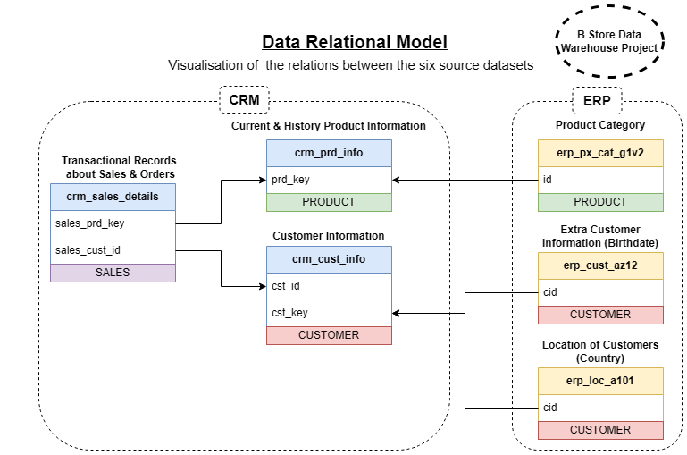
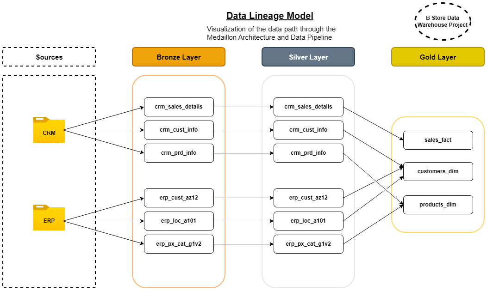

# SQL Server Data Warehouse Project

## Welcome  
Welcome to my **SQL Data Warehouse** project!  
This repository showcases my work in designing and building a **modern data warehouse** using **Microsoft SQL Server**, from raw data ingestion to business-ready analytics.  
The goal of this project is to demonstrate fundamental end-to-end **data engineering** skills using SQL, ETL processes, data modelling, and provide an analytics-ready data layer.

---

## Project Architecture  
The data architecture follows the **Medallion Architecture** Bronze → Silver → Gold.

### Bronze Layer  
- Ingests raw data from **ERP** and **CRM** systems stored as CSV files.  
- Loads data into SQL Server tables without transformations (as-is).  
- Ensures full data capture and traceability of source data.

### Silver Layer  
- Cleanses and standardises data using **stored procedures**.  
- Applies transformations such as:  data cleansing and normalisation, computed columns and data enrichment  
- Produces a consistent, reliable dataset ready for business integration.

### Gold Layer  
- Integrates business logic and performs aggregations.  
- Builds business-ready data into a star schema to support reporting and analytics 
- Delivers business-ready views for:  

---

## Project Requirements  

### Building the Data Warehouse (Data Engineering)
**Objective:**  
Develop a modern data warehouse using SQL Server to consolidate sales data, enabling analytical reporting and informed decision-making.

**Specifications:**  
- **Data Sources:** Import data from two systems — ERP and CRM — provided as CSV files.  
- **Data Quality:** Cleanse and fix data quality issues before analysis.  
- **Integration:** Combine both sources into a unified, analysis-ready model.  
- **Scope:** Focus only on the latest dataset (no historisation).  
- **Documentation:** Provide clear data model documentation for business and analytics teams.

---

### Analytics & Reporting (Data Analysis)
**Objective:**  
Develop SQL-based analytics to deliver actionable insights into:  
- Customer behaviour  
- Product performance  
- Sales trends

---

## Resulting Star Schema and Documentation

### Star Schema Visual Model
Represents the final dimensional model used in the Gold layer. A central fact table is linked to descriptive dimension tables (customers and products), optimised for analytics, reporting, and business intelligence use cases. These insights help stakeholders track key business metrics and support strategic decision-making.

### Star Schema Documentation
This data catalogue documents the **Gold Layer** of the B Store data warehouse, modelled using a **Star Schema**. It contains one central **fact table** `sales` and two related **dimension tables**: `customers` and `products`. The Gold Layer represents business-level data and is structured to enable reporting and analytics.

### Star Schema Overview

- **Fact Table**: `gold.sales.fact` – contains transactional sales data.
- **Dimension Tables**:
  - `gold.customers_dim` – describes customers.
  - `gold.products_dim` – describes products.

### Table: `gold.customers_dim`
**Description:** A dimension table that stores enriched customer profile data, including personal details, demographics, and origin from both CRM and ERP systems.

| Column Name          | Data Type | Description                                              
|----------------------|-----------|------------------------------------------------------------------
| `customer_key_surr`  | INT         | Surrogate key for the customer (PK)              | 
| `customer_id`        | INT         | Unique numerical customer identifier               | 
| `customer_number`    | INT         | Customer number used for tracking                 | 
| `first_name`         | NVARCHAR(50)   | Customer's first name                            |
| `last_name`          | NVARCHAR(50)   | Customer's last name                             |
| `marital_status`     | NVARCHAR(50)   | Marital status of customer ('Married', 'Single') | 
| `birthdate`          | DATE     | Customer's date of birth, formatted as YYYY-MM-DD      | 
| `gender`             | NVARCHAR(50)   | Gender ('Male', 'Female', 'n/a')                 |
| `country`            | NVARCHAR(50)   | Country of residence                             | 
| `record_create_date` | DATE     | Date the customer was registered   | 

### Table: `gold.sales.fact`
**Description:** A dimension table containing product information such as name, category, pricing, and lifecycle dates. Combines product metadata from CRM and ERP sources to support product-level analysis.

| Column Name          | Data Type | Description                                      | 
|----------------------|-----------|--------------------------------------------------|
| `order_number`       | NVARCHAR(50)         | Unique ID for each order              | 
| `product_key_surr`   | INT         | Foreign (surrogate) key to product dimension  | 
| `customer_key_surr`  | INT         | Foreign (surrogate) key to customer dimension | 
| `order_date`         | DATE     | Date when the order was placed                   |
| `order_ship_date`    | DATE     | Date when the order was shipped                  | 
| `order_due_date`     | DATE     | Order's payment due date                           | 
| `sale_price`         | INT  | Total amount of the sale                             | 
| `sale_quantity`      | INT      | Number of units sold                             | 
| `item_price`         | INT  | Price per individual item                            | 

### Table: `gold.products_dim`
**Description:** The central fact table that captures sales transactions, including order dates, quantities, and pricing. Linked to product and customer dimensions to enable time-based and customer/product-level analysis..

| Column Name              | Data Type | Description                                         | 
|--------------------------|-----------|-----------------------------------------------------|
| `product_key_surr`       | INT         | Surrogate key for product (PK)                    | 
| `product_id`             |INT        | Unique numerical product identifier                         | 
| `category_id`            | NVARCHAR(50)         | Reference to category                         | 
| `product_number`         | NVARCHAR(50)   | Internal product number for inventory                            | 
| `product_name`           | NVARCHAR(50)   | Name of the product                                 | 
| `product_cost`           | INT  | Unit price for individual item                        | 
| `product_line`           | NVARCHAR(50)   | Product line classification                         | 
| `product_category`       | NVARCHAR(50)   | High-level category                                 | 
| `product_subcategory_name` | NVARCHAR(50) | Subcategory name                                    | 
| `maintenance`            | NVARCHAR(50)  | Indicates if product includes maintenance service ('Yes', 'No')   | 
| `product_start_sell_date`| DATE     | Start date for product being on sale                | 
| `product_end_sell_date`  | DATE     | End date (if retired) of product                    | 

### Notes

- Foreign keys in the `gold.sales.fact` table link to surrogate keys in the dimension tables.
- `record_create_date` and `product_start_sell_date` can be useful for historical tracking or SCD (slowly changing dimension) analysis.

---

## Supporting Data Models

### Relational Model  
Depicts the logical relationships between the raw CRM and ERP source tables, showing how key fields connect data across different domains like customers, products, and sales before transformation.

### Data Lineage & Flow  
Visualises the full data pipeline from raw source files (CRM and ERP) through the Bronze and Silver layers to the final business-ready Gold views. It illustrates how data moves and transforms across each stage of the medallion architecture.

---

## About Me

I'm a recent graduate motivated by transforming raw data into meaningful insights through clean, efficient data pipelines. I started this project to **deepen my understanding and apply core SQL skills** essential to **end-to-end data engineering**, while also **strengthening my experience in data modelling**. 
